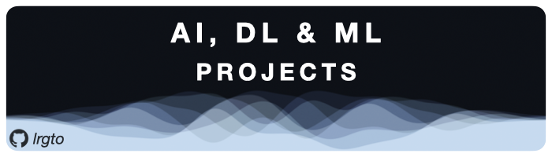
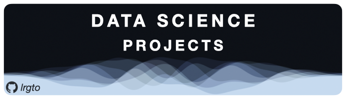
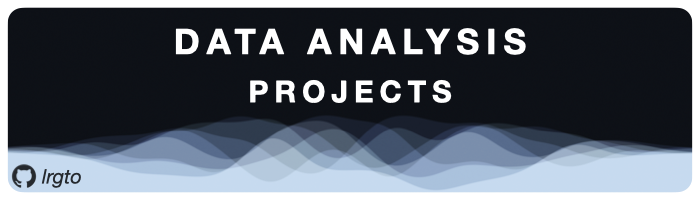
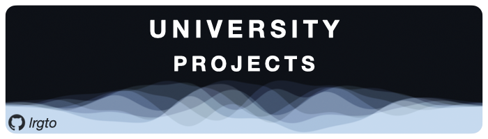
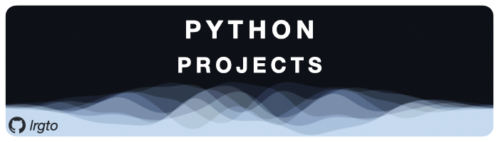
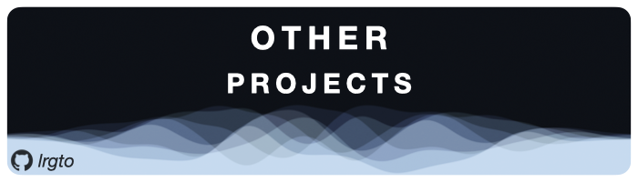

## About Me

I’m a PhD candidate in Radiation and Medical Physics with 6+ years of experience using python and matlab, with a variety of experience in other coding languages. I hold a masters of science degree in artificial intelligence and a bachelors of science in astronomy, space science and astrophysics. I'm passionate about data science for the reason that data can tell us a lot about how we have lived, do live and will live.

## Tech Skills
### Languages
 
 
 
 
 
 
 
 

### Python & AI Libraries
 
 
 

 
 
 
 

### Frameworks & Platforms
 
 

### Hosting & Databases
 
 

## GitHub Stats

<a href="https://github.com/lrgto">
<!--  -->

</a>

<!-- OTHER PROJECTS --> 
## My Projects

<!-- LICENSE -->
## License
Distributed under the CC-BY-SA-4.0: Creative Commons Attribution Share Alike 4.0 International License. 

See [LICENSE.txt](https://github.com/lrgto/lrgto/blob/main/LICENSE.txt) for more information.

<!-- CONTACT -->
## Contact

GitHub: [@lrgto](https://github.com/lrgto) &nbsp;&middot;&nbsp; LinkedIn: [@lrgtomaszewski](https://www.linkedin.com/in/lrgtomaszewski/) &nbsp;&middot;&nbsp; Website: [https://lrgto.github.io](https://lrgto.github.io)

